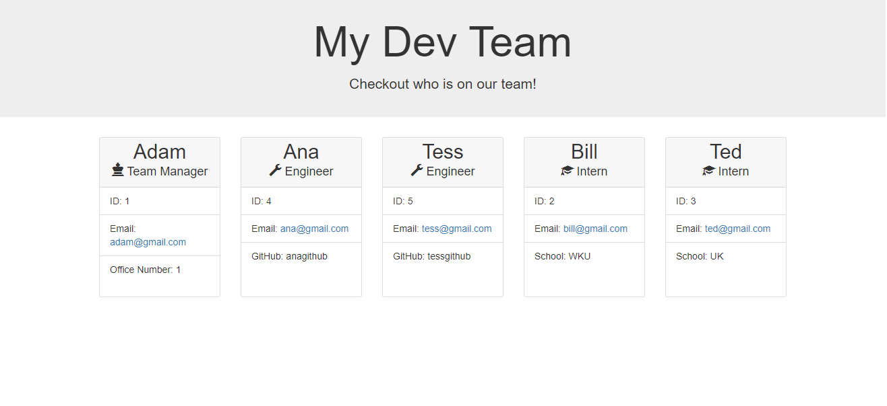

# Team Profile Generator
A Node.js command-line application that generates an HTML webpage that displays summaries for employees.

## Description: 
This project uses Node.js and the Inquirer dependency to generate an index.html file when the user types in commands into the command line. To start the program, the user must first install the required dependencies, and type in node index.js in the root directory. Then the user will need to follow the prompts on the page and type in the correct information. When all of the prompts are answered, it will create a file called index.html in the "dist" folder that will have all of the user's information plugged in!

## Screenshot of Generated Webpage

## About the Project:
This program uses classes to make creation of multiple employees easy. When each employee is created, the inquirer inputs are sent to create a new class (manager, intern, or engineer). When the user says that they are done creating employees, the information is sent to page-template.js, where the array is filtered to create each individual card for the employee. Each card's HTML is added to the template, and when all cards are created, it is sent back to have the file written using the fs.writeFile function. The index.html file is then written to the dist folder, with all of the styling included using the Bootstrap CSS framework.
